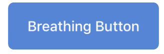
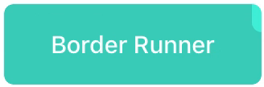
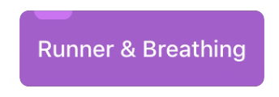

JPButton
==============

Custom UIButton component with some interesting animations written in Swift.

## Usage

Copy files from ```Classes``` folder into your project. Set the UIButton class in Nib to ```JPButton``` or create it programmatically.
Use the demo project to check all available options.

### Breathing animation
<p align="center"></p>
All properties can be set from Interface Builder or from code

* To enable the breathing animation, set ```breathingEnabled``` property to ```true```.
* Customize animation duration by changing ```breathDuration``` property.

### Border Runner animation
<p align="center"></p>
* To start the border runner animation, just call ```startBorderRunner``` method. Runner color, shape and size can be customized by changing parameters of the ```startBorderRunner``` method.
* To stop the animation, call the ```stopAndRemoveBorderRunner``` method.

### Breathing + Border Runner 

<p align="center"></p>

You can combine breathing animation with the border runner animation by setting the ```breathingEnabled``` property to ```true``` and calling the ```startBorderRunner``` method.

## Author

Josip Petric, josip.petric1@gmail.com

## License

JPButton is available under the MIT license. See the LICENSE file for more info.